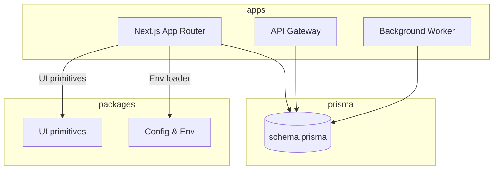
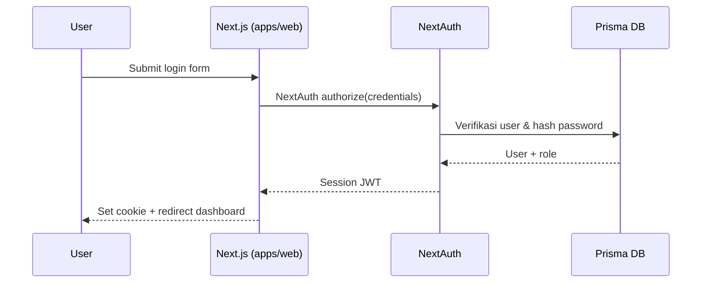
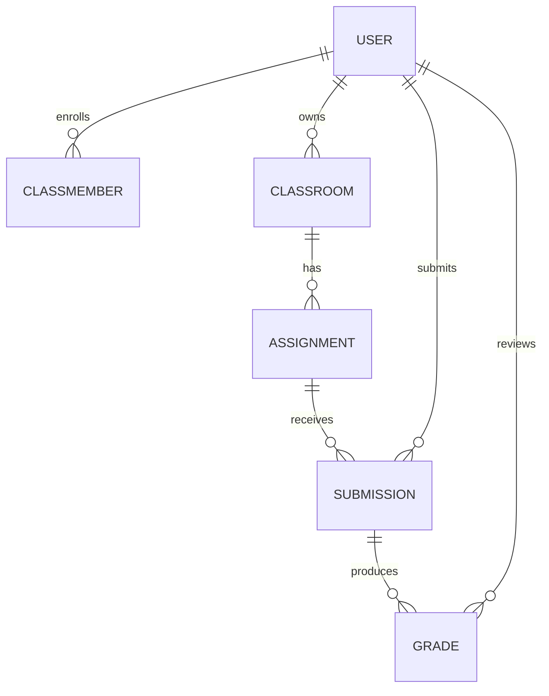

# Classroom Informatika

Repositori monorepo untuk platform pembelajaran internal SMA Wahidiyah. Aplikasi utama adalah Next.js App Router (`apps/web`) dengan dukungan API, worker, dan paket bersama di dalam `packages/*`.

## Arsitektur



- `apps/web/src` memuat aplikasi Next.js, route handler, komponen, dan hook.
- `packages/config` menyediakan utilitas konfigurasi, sedangkan `packages/ui` menyimpan primitive UI yang dapat dibagi lintas aplikasi.
- Prisma digunakan sebagai ORM dengan basis PostgreSQL produksi dan adaptor `pg-mem` untuk pengujian.

## Otentikasi & Otorisasi

Platform menggunakan **NextAuth v5** dengan kredensial internal dan penyedia OAuth. Peran yang tersedia:

| Peran | Deskripsi | Izin utama |
|-------|-----------|------------|
| `SUPER_ADMIN` | Pengelola sistem | akses penuh ke seluruh aksi |
| `ADMIN` | Admin akademik | kelola kelas, tugas, pengguna, review portfolio |
| `MENTOR` | Guru/pengajar | kelola kelas yang dimiliki, membuat tugas, memberi nilai |
| `STUDENT` | Siswa | membaca materi & tugas, mengumpulkan pekerjaan |

Alur autentikasi:



Setiap route handler menggunakan helper RBAC (`@/lib/rbac`) untuk memastikan aksi tertentu hanya dapat dieksekusi oleh peran yang sesuai. Frontend juga melakukan guard pada halaman dashboard siswa/guru/admin.

## Basis Data & Migrasi

Model domain didefinisikan pada `prisma/schema.prisma`. Gambaran relasi utama:



- Migrasi dikelola melalui `prisma migrate`. Skrip CI mengeksekusi `prisma migrate diff` untuk mendeteksi perubahan skema yang belum disinkronkan.
- Pengujian unit menggunakan database ephemeris `pg-mem` yang mengaplikasikan SQL hasil `prisma migrate diff` ke dalam memori.

## Peta Rute Aplikasi

- `/` – beranda publik dan promosi
- `/student/login`, `/student/register` – autentikasi siswa
- `/dashboard/student` – area kerja siswa
- `/dashboard/teacher` – area guru/mentor
- `/admin/**` – halaman admin termasuk penilaian portfolio (`/admin/portfolio`)
- `/api/*` – App Router handlers, diamankan dengan NextAuth + RBAC

## Paket & Boundary

- `apps/web` hanya boleh mengimpor dari `@/` atau paket resmi (`@classroom/*`).
- `packages/ui` berisi komponen presentasional tanpa akses ke Prisma/NextAuth.
- `packages/config` mengenkapsulasi pembacaan variabel lingkungan dan dibagikan lintas aplikasi.

## Siklus Pengembangan

```bash
pnpm install
pnpm dev

# Pemeriksaan sebelum commit
pnpm lint
pnpm typecheck
pnpm test        # Vitest
pnpm --filter web test:e2e
pnpm build
```

Pengujian unit dijalankan via `vitest` (React Testing Library + Prisma test context). Pengujian E2E menggunakan Playwright dengan server Next.js yang dijalankan otomatis.

## CI/CD

Workflow GitHub Actions (`.github/workflows/ci.yml`) menjalankan lint, typecheck, unit test, Playwright, build Next.js, serta `prisma migrate diff` pada matrix Node.js 18 & 20. Artefak turunan `pnpm` dan `turbo` di-cache untuk mempercepat pipeline.

## Keamanan

- Header keamanan diset via `next-secure-headers` (CSP, X-Frame-Options, Referrer Policy, HSTS).
- Semua form menggunakan **React Hook Form + Zod** untuk validasi sisi-klien sebelum request dikirim.
- RBAC disentralisasi di `@/lib/rbac` agar route handler tidak menggandakan logika peran.
